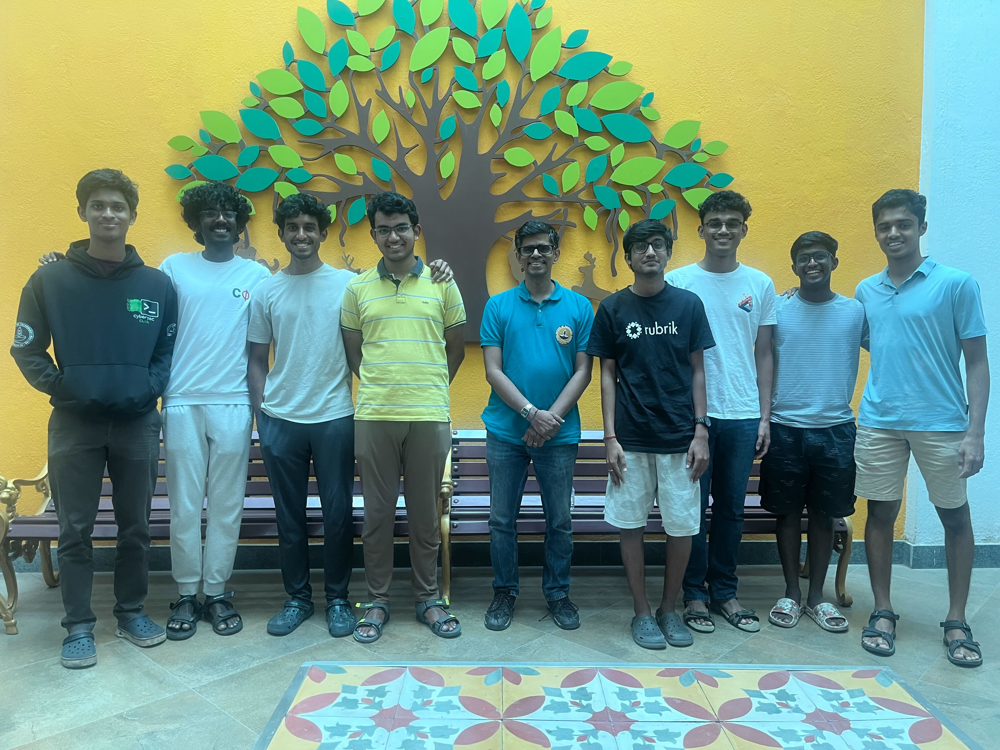

# ECTF '25 - IIT Madras

## Overview

This repository contains our team's implementation for the eCTF '25 TV Decoder System challenge. Our solution focuses on a secure and efficient decoder for satellite TV frame data, implemented on the MAX78000FTHR board. We've developed a novel encryption scheme, detailed in our design document, to meet the challenge requirements while prioritizing security and performance.


## Usage

### Environment Setup

To setup your environment, run

```zsh
pip install ./design
```

### Generate Secrets

To generate secrets, run

```zsh
python -m ectf25_design.gen_secrets global.secrets <channel_id_1> <channel_id_2> ...
```

>[!Warning]
>Please ensure this is run in the parent directory, to ensure `global.secrets` is generated in the parent directory.

This step is essential to build the decoder firmware. 

### Generate Subscriptions

To generate a subscription for a specific channel and timestamp range, use the following workflow

```zsh
python -m ectf25_design.gen_subscription global.secrets <path/to/subscription/binary> <DECODER_ID> <start_timestamp> <end_timestamp> <channel_id>
```
### Build Decoder

To build the decoder firmware, use the following workflow

```zsh
cd ./decoder
make DECODER_ID=<DECODERID_in_decimal_or_hex>
```

> [!Note]
> The output binary will be located at `./decoder/build/max78000.bin`


## Us, your frenemies ;)

- Arivoli Ramamoorthy
- Abhinav I S
- Sanjeev Subrahmaniyan
- Madhav Tadepalli
- Nithin Ken Maran
- Kevin Kinsey
- Athish Pranav Dharmalingam
- Md. Isfarul Haque
- Mohitabinav M.
- Nitin G


